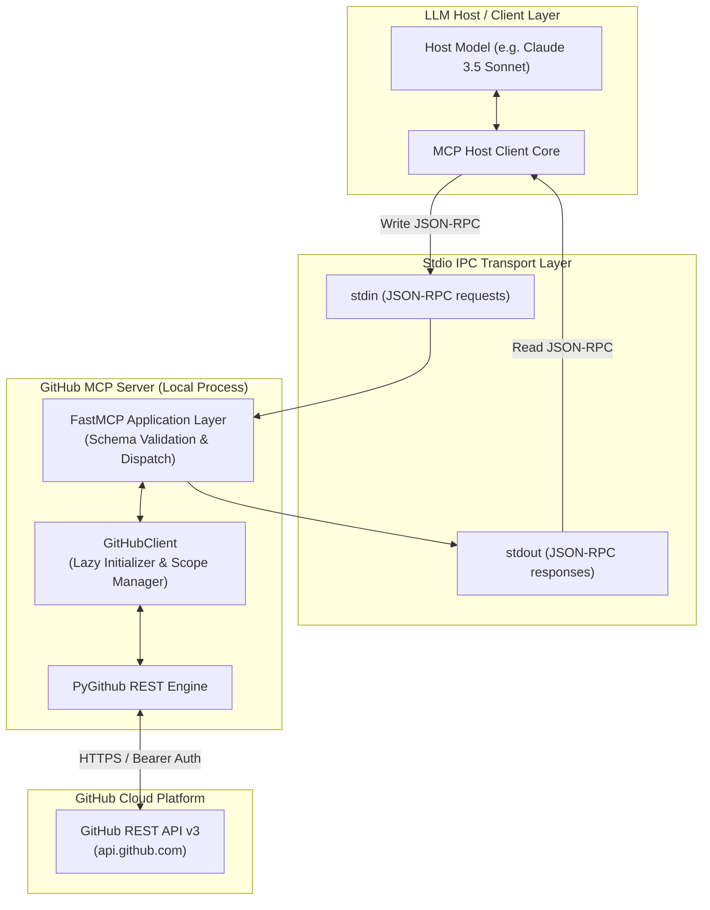
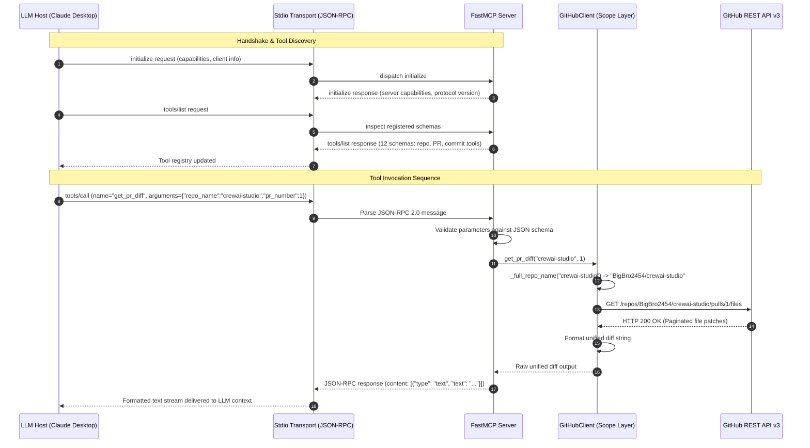

# GitHub MCP Server (`BigBro2454`)

[](https://modelcontextprotocol.io/)
[](https://github.com/jlowin/fastmcp)
[](https://www.python.org/)
[]()

Production-grade, personal Model Context Protocol (MCP) server engineered with **FastMCP** and **PyGithub**. This server exposes high-fidelity GitHub operations (repository intelligence, pull request lifecycle, unified diff inspection, and git commit history) scoped specifically to the `BigBro2454` namespace over standard input/output (stdio) transport.

---

## Table of Contents

- [System Architecture](#system-architecture)
  - [Architecture Topology](#architecture-topology)
  - [Sequence Execution Lifecycle](#sequence-execution-lifecycle)
- [Tool Taxonomy & Schema Specifications](#tool-taxonomy--schema-specifications)
  - [1. Repository Intelligence](#1-repository-intelligence)
  - [2. Pull Request & Code Review Intelligence](#2-pull-request--code-review-intelligence)
  - [3. Commit & Version History Intelligence](#3-commit--version-history-intelligence)
- [Security & Namespace Scoping Model](#security--namespace-scoping-model)
- [Transport Protocol & Framing](#transport-protocol--framing)
- [Installation & Host Configuration](#installation--host-configuration)
  - [Prerequisites](#prerequisites)
  - [Environment Setup](#environment-setup)
  - [Host Configuration (Claude Desktop)](#host-configuration-claude-desktop)
- [Verification & Smoke Testing](#verification--smoke-testing)
- [Error Handling & API Resilience](#error-handling--api-resilience)

---

## System Architecture

### Architecture Topology

The server implements the Model Context Protocol specification over stdio. An LLM host (e.g., Claude Desktop, Antigravity, or Cursor) spawns the Python runtime as a subprocess, performing bidirectional JSON-RPC 2.0 communication over standard file descriptors (`stdin` / `stdout`).



### Sequence Execution Lifecycle

The sequence below depicts the end-to-end execution of a tool invocation (such as `get_pr_diff`) from initial host discovery to upstream REST resolution:



---

## Tool Taxonomy & Schema Specifications

The server exposes **12 purpose-built tools** categorized into three primary operational domains:

```
github-mcp-server
├── Repository Intelligence
│   ├── list_my_repos
│   ├── get_repo_info
│   ├── list_branches
│   └── get_file_contents
├── Pull Request & Code Review Intelligence
│   ├── list_pull_requests
│   ├── get_pull_request
│   ├── get_pr_diff
│   ├── get_pr_files
│   └── list_pr_comments
└── Commit & Version History Intelligence
    ├── list_recent_commits
    ├── get_commit_details
    └── compare_branches
```

### 1. Repository Intelligence

#### `list_my_repos`
Enumerate all repositories owned by `BigBro2454` with optional visibility, sorting, and language filters.
- **Parameters**:
  ```json
  {
    "type": "object",
    "properties": {
      "visibility": {
        "type": "string",
        "default": "all",
        "description": "Filter by visibility — 'all', 'public', or 'private'."
      },
      "sort": {
        "type": "string",
        "default": "updated",
        "description": "Sort order — 'updated', 'created', 'pushed', or 'full_name'."
      },
      "language": {
        "type": ["string", "null"],
        "default": null,
        "description": "Optional filter by primary language (e.g. 'Python', 'TypeScript')."
      }
    },
    "additionalProperties": false
  }
  ```

#### `get_repo_info`
Fetches comprehensive repository metadata including star count, forks, open issues, default branch, topics, and clone URLs.
- **Parameters**:
  ```json
  {
    "type": "object",
    "properties": {
      "repo_name": {
        "type": "string",
        "description": "Repository name (e.g. 'crewai-studio'). Short name or owner/name accepted."
      }
    },
    "required": ["repo_name"],
    "additionalProperties": false
  }
  ```

#### `list_branches`
Returns all branches along with latest commit SHAs and branch protection statuses.
- **Parameters**:
  ```json
  {
    "type": "object",
    "properties": {
      "repo_name": {
        "type": "string",
        "description": "Repository name."
      }
    },
    "required": ["repo_name"],
    "additionalProperties": false
  }
  ```

#### `get_file_contents`
Retrieves the raw content of a file or lists children if targeting a directory at a designated git ref.
- **Parameters**:
  ```json
  {
    "type": "object",
    "properties": {
      "repo_name": {
        "type": "string",
        "description": "Repository name."
      },
      "file_path": {
        "type": "string",
        "description": "Path to the file or directory within the repository."
      },
      "ref": {
        "type": ["string", "null"],
        "default": null,
        "description": "Optional git ref (branch, tag, or commit SHA). Defaults to default branch."
      }
    },
    "required": ["repo_name", "file_path"],
    "additionalProperties": false
  }
  ```

---

### 2. Pull Request & Code Review Intelligence

#### `list_pull_requests`
Lists pull requests for the repository filtered by lifecycle state.
- **Parameters**:
  ```json
  {
    "type": "object",
    "properties": {
      "repo_name": {
        "type": "string",
        "description": "Repository name."
      },
      "state": {
        "type": "string",
        "default": "open",
        "description": "PR state filter — 'open', 'closed', or 'all'."
      }
    },
    "required": ["repo_name"],
    "additionalProperties": false
  }
  ```

#### `get_pull_request`
Fetches in-depth metadata for a single pull request including author, branch refs, mergeable state, line changes, requested reviewers, and labels.
- **Parameters**:
  ```json
  {
    "type": "object",
    "properties": {
      "repo_name": { "type": "string", "description": "Repository name." },
      "pr_number": { "type": "integer", "description": "The pull request number." }
    },
    "required": ["repo_name", "pr_number"],
    "additionalProperties": false
  }
  ```

#### `get_pr_diff`
Synthesizes a unified diff patch string (`--- a/... +++ b/...`) across all files altered by the pull request.
- **Parameters**:
  ```json
  {
    "type": "object",
    "properties": {
      "repo_name": { "type": "string", "description": "Repository name." },
      "pr_number": { "type": "integer", "description": "The pull request number." }
    },
    "required": ["repo_name", "pr_number"],
    "additionalProperties": false
  }
  ```

#### `get_pr_files`
Returns an array of modified files with additions, deletions, patch segments, and change status (`added`, `modified`, `removed`).
- **Parameters**:
  ```json
  {
    "type": "object",
    "properties": {
      "repo_name": { "type": "string", "description": "Repository name." },
      "pr_number": { "type": "integer", "description": "The pull request number." }
    },
    "required": ["repo_name", "pr_number"],
    "additionalProperties": false
  }
  ```

#### `list_pr_comments`
Aggregates and chronologically sorts both top-level issue discussion comments and inline code review comments.
- **Parameters**:
  ```json
  {
    "type": "object",
    "properties": {
      "repo_name": { "type": "string", "description": "Repository name." },
      "pr_number": { "type": "integer", "description": "The pull request number." }
    },
    "required": ["repo_name", "pr_number"],
    "additionalProperties": false
  }
  ```

---

### 3. Commit & Version History Intelligence

#### `list_recent_commits`
Extracts the chronological commit history of a branch up to a configurable ceiling (max 50).
- **Parameters**:
  ```json
  {
    "type": "object",
    "properties": {
      "repo_name": { "type": "string", "description": "Repository name." },
      "branch": {
        "type": ["string", "null"],
        "default": null,
        "description": "Branch name. Defaults to the repository's default branch."
      },
      "limit": {
        "type": "integer",
        "default": 10,
        "description": "Maximum number of commits to return (1-50)."
      }
    },
    "required": ["repo_name"],
    "additionalProperties": false
  }
  ```

#### `get_commit_details`
Provides commit message, authorship timestamp, change metrics (`stats.additions`, `stats.deletions`), and per-file diff patches for a given SHA.
- **Parameters**:
  ```json
  {
    "type": "object",
    "properties": {
      "repo_name": { "type": "string", "description": "Repository name." },
      "sha": { "type": "string", "description": "The commit SHA (abbreviated or full 40-char SHA)." }
    },
    "required": ["repo_name", "sha"],
    "additionalProperties": false
  }
  ```

#### `compare_branches`
Performs two-way comparison between git references (`base...head`), providing ahead/behind commit counts, commit logs, and file alteration summaries.
- **Parameters**:
  ```json
  {
    "type": "object",
    "properties": {
      "repo_name": { "type": "string", "description": "Repository name." },
      "base": { "type": "string", "description": "Base branch or ref (e.g. 'main')." },
      "head": { "type": "string", "description": "Head branch or ref (e.g. 'feature-branch')." }
    },
    "required": ["repo_name", "base", "head"],
    "additionalProperties": false
  }
  ```

---

## Security & Namespace Scoping Model

1. **Deterministic Account Scoping**:
   All operations invoke `_full_repo_name(repo_name)`. If a plain repository identifier (`"my-service"`) is supplied, it is automatically prefixed with `BigBro2454/my-service`. This ensures that tools cannot unintentionally alter foreign user contexts.
2. **Credential Hygiene**:
   Tokens are injected strictly through standard environment variables (`GITHUB_TOKEN`) or `.env` files. Authentication headers are isolated inside PyGithub's session and never logged to stdout or exposed via MCP tool schemas.
3. **Read-Only / Principle of Least Privilege**:
   The current operational toolset is purely observational and analytical (inspections, reads, comparisons, and diffs). Destructive or mutating verbs (`delete_repo`, `force_push`, `merge_pr`) are strictly excluded from the server exposure surface.

---

## Transport Protocol & Framing

- **Transport Mechanism**: Standard Input/Output (`stdio`).
- **Framing**: JSON-RPC 2.0 messages delimited by newline tokens.
- **Payload Content**:
  - Outgoing text responses are structured as standard MCP `TextContent` objects:
    ```json
    {
      "content": [
        {
          "type": "text",
          "text": "{\n  \"name\": \"crewai-studio\",\n  ...\n}"
        }
      ]
    }
    ```

---

## Installation & Host Configuration

### Prerequisites
- Python 3.10+
- GitHub Personal Access Token (classic with `repo` and `read:user` scopes, or fine-grained token with Repository Read permissions).

### Environment Setup

```bash
# Clone repository
git clone https://github.com/BigBro2454/github-mcp-server.git
cd github-mcp-server

# Create virtual environment
python3 -m venv .venv
source .venv/bin/activate

# Install dependencies
pip install -r requirements.txt

# Configure environment secrets
cp .env.example .env
# Set your token: GITHUB_TOKEN=ghp_...
```

### Host Configuration (Claude Desktop)

Open your Claude Desktop configuration file:
- **macOS**: `~/Library/Application Support/Claude/claude_desktop_config.json`
- **Windows**: `%APPDATA%\Claude\claude_desktop_config.json`

Add the `github-personal` server entry under `mcpServers`:

```json
{
  "mcpServers": {
    "github-personal": {
      "command": "/Users/ishan03/Workspace/projects/playground/github-mcp-server/.venv/bin/python3",
      "args": [
        "/Users/ishan03/Workspace/projects/playground/github-mcp-server/server.py"
      ],
      "env": {
        "GITHUB_TOKEN": "ghp_YOUR_ACTUAL_PERSONAL_ACCESS_TOKEN"
      }
    }
  }
}
```

> **Note**: Restart Claude Desktop after saving the configuration file.

---

## Verification & Smoke Testing

The repository contains an automated validation suite (`smoke_test.py`) that performs end-to-end assertions against the live GitHub API using configured credentials.

```bash
./.venv/bin/python smoke_test.py
```

### Verification Output Matrix

```text
============================================================
🧪 GitHub MCP Server — Smoke Tests
   Target user: BigBro2454
============================================================

📂 Repo Tools:
  ✅ list_my_repos — [{"name": "crewai-studio", ...}]
  ✅ get_repo_info — repo=crewai-studio
  ✅ list_branches — repo=crewai-studio, result=[{"name": "main", ...}]
  ✅ get_file_contents — repo=crewai-studio

🔀 PR & Review Tools:
  ✅ list_pull_requests — repo=crewai-studio
  ✅ get_pull_request — SKIPPED — (asserted if PRs exist)
  ✅ get_pr_diff — SKIPPED — (asserted if PRs exist)
  ✅ get_pr_files — SKIPPED — (asserted if PRs exist)
  ✅ list_pr_comments — SKIPPED — (asserted if PRs exist)

📝 Commit Tools:
  ✅ list_recent_commits — repo=crewai-studio
  ✅ get_commit_details — sha=f4fee5dd
  ✅ compare_branches — SKIPPED — (asserted when >1 branch exists)

============================================================
Results: 12 passed, 0 failed, 12 total
============================================================
```

To run interactive inspection with UI:
```bash
fastmcp dev server.py
```

---

## Error Handling & API Resilience

- **Lazy Initialization**: `GitHubClient` is instantiated only upon receiving the initial tool call, ensuring fast startup during host discovery.
- **Safe Fallbacks**: Missing entities (such as empty PR comment lists or non-existent files) yield descriptive status messages rather than crashing the JSON-RPC daemon.
- **UTF-8 Sanitization**: Binary and non-UTF-8 file payloads are decoded safely using `errors="replace"` to avoid serialization exceptions during stdio transmission.
