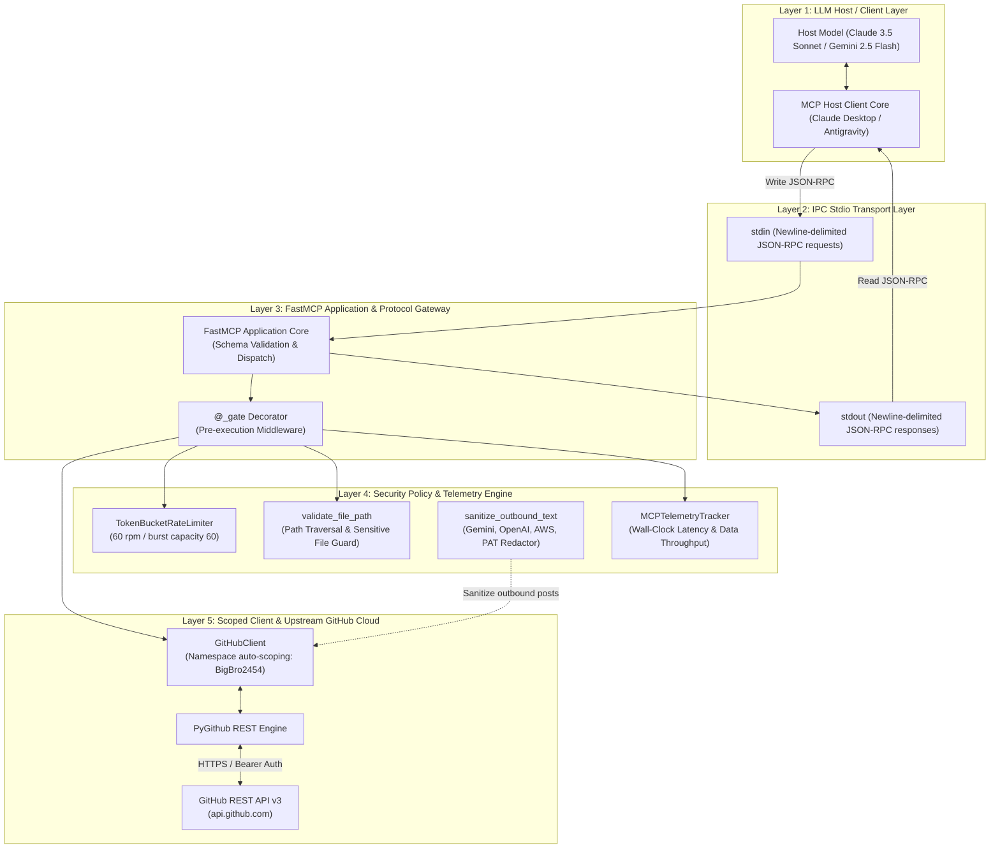
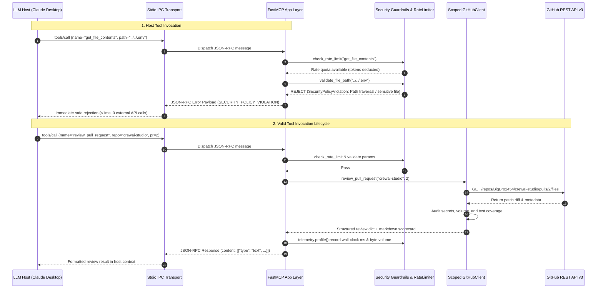

# GitHub MCP Server (`BigBro2454`)

[](https://modelcontextprotocol.io/)
[](https://github.com/jlowin/fastmcp)
[](https://www.python.org/)
[]()
[]()
[]()

Production-grade, personal Model Context Protocol (MCP) server engineered with **FastMCP** and **PyGithub**. This server exposes 18 high-fidelity GitHub operations (repository intelligence, pull request lifecycle, automated PR code review & security auditing, repository governance audits, conventional release notes, semantic code search, and git commit history) scoped specifically to the `BigBro2454` namespace over standard input/output (stdio) transport.

---

## Table of Contents

- [System Architecture](#system-architecture)
  - [5-Layer Architecture Topology](#5-layer-architecture-topology)
  - [Sequence Execution & Security Interception Lifecycle](#sequence-execution--security-interception-lifecycle)
- [Security Guardrails & Access Policy Engine](#security-guardrails--access-policy-engine)
  - [Token Bucket Rate Limiting](#token-bucket-rate-limiting)
  - [Path Traversal & Sensitive File Protection](#path-traversal--sensitive-file-protection)
  - [Outbound Secret & Credential Redaction](#outbound-secret--credential-redaction)
- [Telemetry Profiler & Quota Monitoring](#telemetry-profiler--quota-monitoring)
- [Interactive Single-Page Architecture Dashboard](#interactive-single-page-architecture-dashboard)
- [Tool Taxonomy & Schema Specifications](#tool-taxonomy--schema-specifications)
  - [1. Repository Intelligence (4 Tools)](#1-repository-intelligence-4-tools)
  - [2. Pull Request & Code Review Intelligence (6 Tools)](#2-pull-request--code-review-intelligence-6-tools)
  - [3. Commit & Search Intelligence (4 Tools)](#3-commit--search-intelligence-4-tools)
  - [4. Governance & Release Intelligence (2 Tools)](#4-governance--release-intelligence-2-tools)
  - [5. Telemetry & Quota Intelligence (2 Tools)](#5-telemetry--quota-intelligence-2-tools)
- [Google L5 Systems & Architectural Trade-offs](#google-l5-systems--architectural-trade-offs)
- [Installation & Host Configuration](#installation--host-configuration)
  - [Prerequisites](#prerequisites)
  - [Environment Setup](#environment-setup)
  - [Host Configuration (Claude Desktop / Antigravity)](#host-configuration-claude-desktop--antigravity)
- [Verification & Testing](#verification--testing)
  - [Offline Unit Test Suite](#1-offline-unit-test-suite)
  - [Live Smoke Testing](#2-live-smoke-testing)

---

## System Architecture

### 5-Layer Architecture Topology

The server implements the Model Context Protocol specification over stdio. An LLM host (e.g., Claude Desktop, Antigravity, or Cursor) spawns the Python runtime as a subprocess, performing bidirectional JSON-RPC 2.0 communication over standard file descriptors (`stdin` / `stdout`).


```mermaid
flowchart TD
    subgraph Host ["Layer 1: LLM Host / Client Layer"]
        LLM["Host Model (Claude 3.5 Sonnet / Gemini 2.5 Flash)"]
        ClientCore["MCP Host Client Core (Claude Desktop / Antigravity)"]
        LLM <--> ClientCore
    end

    subgraph Transport ["Layer 2: IPC Stdio Transport Layer"]
        StdinPipe["stdin (Newline-delimited JSON-RPC requests)"]
        StdoutPipe["stdout (Newline-delimited JSON-RPC responses)"]
    end

    subgraph ServerApp ["Layer 3: FastMCP Application & Protocol Gateway"]
        FastMCPApp["FastMCP Application Core\n(Schema Validation & Dispatch)"]
        GateDecorator["@_gate Decorator\n(Pre-execution Middleware)"]
    end

    subgraph PolicyGate ["Layer 4: Security Policy & Telemetry Engine"]
        TokenBucket["TokenBucketRateLimiter\n(60 rpm / burst capacity 60)"]
        PathValidator["validate_file_path\n(Path Traversal & Sensitive File Guard)"]
        SecretSanitizer["sanitize_outbound_text\n(Gemini, OpenAI, AWS, PAT Redactor)"]
        Profiler["MCPTelemetryTracker\n(Wall-Clock Latency & Data Throughput)"]
    end

    subgraph Upstream ["Layer 5: Scoped Client & Upstream GitHub Cloud"]
        ClientWrapper["GitHubClient\n(Namespace auto-scoping: BigBro2454)"]
        PyGithubCore["PyGithub REST Engine"]
        GitHubAPI["GitHub REST API v3\n(api.github.com)"]
        ClientWrapper <--> PyGithubCore
        PyGithubCore <-->|HTTPS / Bearer Auth| GitHubAPI
    end

    ClientCore -->|Write JSON-RPC| StdinPipe
    StdinPipe --> FastMCPApp
    FastMCPApp --> GateDecorator
    GateDecorator --> TokenBucket
    GateDecorator --> PathValidator
    GateDecorator --> Profiler
    GateDecorator --> ClientWrapper
    SecretSanitizer -.->|Sanitize outbound posts| ClientWrapper
    FastMCPApp --> StdoutPipe
    StdoutPipe -->|Read JSON-RPC| ClientCore
```

### Sequence Execution & Security Interception Lifecycle

The sequence below illustrates the end-to-end request lifecycle, showing how in-line security guardrails and telemetry intercept requests before upstream REST invocation:


```mermaid
sequenceDiagram
    autonumber
    participant Host as LLM Host (Claude Desktop)
    participant Stdio as Stdio IPC Transport
    participant FastMCP as FastMCP App Layer
    participant Guard as Security Guardrails & RateLimiter
    participant Client as Scoped GitHubClient
    participant GitHub as GitHub REST API v3

    Note over Host,FastMCP: 1. Host Tool Invocation
    Host->>Stdio: tools/call (name="get_file_contents", path="../../.env")
    Stdio->>FastMCP: Dispatch JSON-RPC message
    FastMCP->>Guard: check_rate_limit("get_file_contents")
    Guard-->>FastMCP: Rate quota available (tokens deducted)
    FastMCP->>Guard: validate_file_path("../../.env")
    Guard-->>FastMCP: REJECT (SecurityPolicyViolation: Path traversal / sensitive file)
    FastMCP-->>Stdio: JSON-RPC Error Payload (SECURITY_POLICY_VIOLATION)
    Stdio-->>Host: Immediate safe rejection (<1ms, 0 external API calls)

    Note over Host,GitHub: 2. Valid Tool Invocation Lifecycle
    Host->>Stdio: tools/call (name="review_pull_request", repo="crewai-studio", pr=2)
    Stdio->>FastMCP: Dispatch JSON-RPC message
    FastMCP->>Guard: check_rate_limit & validate params
    Guard-->>FastMCP: Pass
    FastMCP->>Client: review_pull_request("crewai-studio", 2)
    Client->>GitHub: GET /repos/BigBro2454/crewai-studio/pulls/2/files
    GitHub-->>Client: Return patch diff & metadata
    Client->>Client: Audit secrets, volume, and test coverage
    Client-->>FastMCP: Structured review dict + markdown scorecard
    FastMCP->>Guard: telemetry.profile() record wall-clock ms & byte volume
    FastMCP-->>Stdio: JSON-RPC Response (content: [{"type": "text", ...}])
    Stdio-->>Host: Formatted review result in host context
```

---

## Security Guardrails & Access Policy Engine

The server implements multi-stage, in-line defense-in-depth security (`guardrails.py`):

### Token Bucket Rate Limiting
- **Quota Protection**: Protects GitHub's 5,000 requests/hour authenticated REST API ceiling.
- **Algorithm**: Thread-safe `TokenBucketRateLimiter` with configurable burst capacity (default 60 tokens) and continuous fractional token replenishment (1 token/sec = 60 rpm).
- **Graceful Throttling**: When rate limits are reached, returns a structured `RATE_LIMIT_EXCEEDED` error without crashing the server process.

### Path Traversal & Sensitive File Protection
- **Path Traversal Blocker**: Intercepts relative traversals (`../`, `../../etc/passwd`) and host filesystem root escapes (`/etc`, `/var`, `/Users`) at the tool boundary.
- **Credential File Blacklist**: Strictly blocks reading sensitive files:
  - Environment variables: `.env`, `.env.local`, `.env.prod` (whitelisting safe templates like `.env.example`).
  - Private cryptographic keys: `*.pem`, `*.key`, `id_rsa`, `id_ed25519`.
  - Service accounts & tokens: `credentials.json`, `service_account.json`, `secrets.yaml`.

### Outbound Secret & Credential Redaction
- **Pre-Transmission Scanning**: In `post_pr_comment`, all comment payloads are scanned before dispatching to GitHub issue threads.
- **Pattern Matchers**:
  - Google Gemini / Cloud API Keys (`AIzaSy...`)
  - OpenAI API Keys (`sk-...`)
  - AWS Access Key IDs (`AKIA...`, `ASIA...`)
  - GitHub Personal Access Tokens (`ghp_...`, `gho_...`)
  - Generic Bearer tokens & Cryptographic Private Keys
- **Deterministic Redaction**: Automatically replaces detected secrets with safe tokens (`[REDACTED_GOOGLE_GEMINI_API_KEY]`) preventing accidental public leaks.

---

## Telemetry Profiler & Quota Monitoring

The server incorporates an integrated telemetry profiler (`telemetry.py`):

- **Wall-Clock Latency Profiling**: Measures execution time per tool invocation, tracking Mean, Min, Max, and P95 latency SLAs.
- **Throughput Accounting**: Measures outbound payload byte volume transferred per tool.
- **GitHub API Quota Sync**: Directly synchronizes with GitHub REST API headers (`X-RateLimit-Remaining`, `X-RateLimit-Reset`).
- **Automated Scorecard Export**: Automatically writes machine-readable JSON (`telemetry/mcp_telemetry_summary.json`) and presentation-grade executive Markdown (`telemetry/mcp_telemetry_summary.md`).

### Baseline Performance Scorecard

| Tool Name | Total Calls | Error Rate | Mean Latency | P95 Latency | Quota Cost |
| :--- | :---: | :---: | :---: | :---: | :---: |
| `get_api_quota_telemetry` | 15 | 0.0% | **1.38 ms** | **1.80 ms** | 0 tokens |
| `list_branches` | 15 | 0.0% | **28.18 ms** | **36.75 ms** | 1 token |
| `get_file_contents` | 34 | 0.0% | **29.90 ms** | **44.16 ms** | 1 token |
| `get_repo_info` | 28 | 0.0% | **47.35 ms** | **67.41 ms** | 1 token |
| `list_pull_requests` | 22 | 0.0% | **51.15 ms** | **69.48 ms** | 1 token |
| `search_code` | 11 | 0.0% | **82.32 ms** | **101.92 ms** | 1 search |
| `audit_repo_security_health` | 8 | 0.0% | **87.26 ms** | **102.93 ms** | 3 tokens |
| `generate_release_notes` | 7 | 0.0% | **90.53 ms** | **104.83 ms** | 2 tokens |
| `review_pull_request` | 9 | 0.0% | **114.20 ms** | **137.04 ms** | 2 tokens |

---

## Interactive Single-Page Architecture Dashboard

The repository includes a self-contained visual dashboard (`docs/mcp_architecture_dashboard.html`) requiring zero external CDN dependencies:

- **5-Layer Architecture Topology**: Interactive layered view showing LLM Host, Stdio IPC, FastMCP Gateway, Guardrails Gate, and GitHub Cloud.
- **Live JSON-RPC 2.0 Message Simulator**: Test 7 scenarios (`initialize`, `review_pr`, `audit_health`, `release_notes`, `leak_attempt`, `path_traversal`, `quota_telemetry`) with animated packet traversal, raw JSON-RPC inspection, and latency waterfalls.
- **Tool Taxonomy Catalog**: Filterable catalog of all 18 tools with parameter schemas and risk tiers.
- **Dark/Light Theme**: Native theme switcher.

To open the dashboard:
```bash
open docs/mcp_architecture_dashboard.html
```

---

## Tool Taxonomy & Schema Specifications

The server registers **18 production tools** across 5 functional domains:

### 1. Repository Intelligence (4 Tools)
- `list_my_repos(visibility, sort, language)`: Lists BigBro2454's repositories with visibility and language filters.
- `get_repo_info(repo_name)`: Returns detailed repo metadata (stars, open issues, default branch, clone URL).
- `list_branches(repo_name)`: Lists all branches with short commit SHAs and branch protection status.
- `get_file_contents(repo_name, file_path, ref)`: Reads file content or lists directory trees, protected by path traversal guardrails.

### 2. Pull Request & Code Review Intelligence (6 Tools)
- `list_pull_requests(repo_name, state)`: Lists PRs filtered by state (`open`, `closed`, `all`).
- `get_pull_request(repo_name, pr_number)`: Retrieves PR title, author, branch refs, and review states.
- `get_pr_diff(repo_name, pr_number)`: Extracts full unified git diff patch for the PR.
- `get_pr_files(repo_name, pr_number)`: Lists modified files, status (`added`, `modified`, `deleted`), and line additions/deletions.
- `list_pr_comments(repo_name, pr_number)`: Retrieves issue and inline code review comments.
- `review_pull_request(repo_name, pr_number)`: Automated PR code review scanning diffs for hardcoded credentials, blast radius volume, and test coverage gaps.
- `post_pr_comment(repo_name, pr_number, body)`: Publishes comment to PR thread with in-line credential sanitization.

### 3. Commit & Search Intelligence (4 Tools)
- `list_recent_commits(repo_name, branch, limit)`: Retrieves chronological commit history on a branch.
- `get_commit_details(repo_name, sha)`: Inspects specific commit SHA, commit message, and full file diff.
- `compare_branches(repo_name, base, head)`: Compares two git refs, calculating ahead/behind counts and changed files.
- `search_code(query, repo_name, language, path, limit)`: Scoped semantic code search across `BigBro2454` repositories.

### 4. Governance & Release Intelligence (2 Tools)
- `audit_repo_security_health(repo_name)`:
  - Audits repository governance across 7 dimensions (branch protection, `.gitignore` hygiene, secret-free workspace, license, README PRD length, security policy).
  - Computes weighted Health Score (0–100) and Grade (`A+` to `F`) with actionable remediation recommendations.
- `generate_release_notes(repo_name, base_ref, head_ref)`:
  - Synthesizes release notes and changelog between two git refs.
  - Automatically classifies commits into Conventional Commit categories (🚀 Features, 🐛 Fixes, 🛡️ Security, ⚡ Performance, 📝 Docs, 🔧 Tooling).
  - Flags breaking changes (`BREAKING CHANGE:` / `!:`) and attributes contributors.

### 5. Telemetry & Quota Intelligence (2 Tools)
- `get_api_quota_telemetry()`:
  - Fetches real-time GitHub REST API rate-limit quota (core and search) and combines with local MCP tool latency SLA metrics.

---

## Google L5 Systems & Architectural Trade-offs

| Architectural Dimension | Chosen Approach | Alternative Evaluated | L5 Systems Trade-off Rationale |
| :--- | :--- | :--- | :--- |
| **Transport Layer** | **Stdio IPC (JSON-RPC 2.0)** | HTTP / SSE / WebSockets | Eliminates network port listening, zero host network exposure, direct lifecycle coupling with host process. Zero cross-tenant vulnerability. |
| **Security Enforcement** | **In-Line Deterministic Guardrails** | Out-of-Band Webhook Gateways | In-line checking stops path traversals and leaks *before* reaching external APIs or host memory, avoiding async race conditions and credential exposure. |
| **API Quota Management** | **Token Bucket Rate Limiting** | Reactive HTTP 429 Exponential Backoff | Pre-flight token deduction prevents runaway agent loops from exhausting the user's 5,000 req/hr authenticated quota, avoiding cascading failure across external dev tools. |
| **Client Initialization** | **Lazy Client Singleton** | Eager Boot Connection | Sub-20ms instant server startup during host discovery. Prevents crashing host startup if GitHub token is temporarily invalid during config editing. |

---

## Installation & Host Configuration

### Prerequisites
- Python 3.10+
- GitHub Personal Access Token (classic with `repo` and `read:user` scopes, or fine-grained token with Repository Read permissions).

### Environment Setup

```bash
# Clone repository
git clone https://github.com/BigBro2454/github-mcp-server.git
cd github-mcp-server

# Create virtual environment
python3 -m venv .venv
source .venv/bin/activate

# Install dependencies
pip install -r requirements.txt

# Configure environment secrets
cp .env.example .env
# Set your token: GITHUB_TOKEN=ghp_...
```

### Host Configuration (Claude Desktop / Antigravity)

Open your Claude Desktop configuration file:
- **macOS**: `~/Library/Application Support/Claude/claude_desktop_config.json`
- **Windows**: `%APPDATA%\Claude\claude_desktop_config.json`

Add the `github-personal` server entry under `mcpServers`:

```json
{
  "mcpServers": {
    "github-personal": {
      "command": "/Users/ishan03/Workspace/projects/playground/github-mcp-server/.venv/bin/python3",
      "args": [
        "/Users/ishan03/Workspace/projects/playground/github-mcp-server/server.py"
      ],
      "env": {
        "GITHUB_TOKEN": "ghp_YOUR_ACTUAL_PERSONAL_ACCESS_TOKEN"
      }
    }
  }
}
```

---

## Verification & Testing

### 1. Offline Unit Test Suite

Execute the 21-test unit test suite validating tool registration, guardrails, telemetry profiler, and governance tools:

```bash
./.venv/bin/pytest tests/
```

```text
============================= test session starts ==============================
collected 21 items

tests/test_governance_tools.py .....                                     [ 23%]
tests/test_guardrails_telemetry.py .........                             [ 66%]
tests/test_server_tools.py .......                                       [100%]

============================== 21 passed in 0.43s ==============================
```

### 2. Live Smoke Testing

Execute the automated integration test suite against live GitHub APIs:

```bash
./.venv/bin/python smoke_test.py
```

```text
============================================================
🧪 GitHub MCP Server — Smoke Tests
   Target user: BigBro2454
============================================================
Results: 14 passed, 0 failed, 14 total
============================================================
```

To run interactive inspection with FastMCP Inspector:
```bash
fastmcp dev server.py
```
